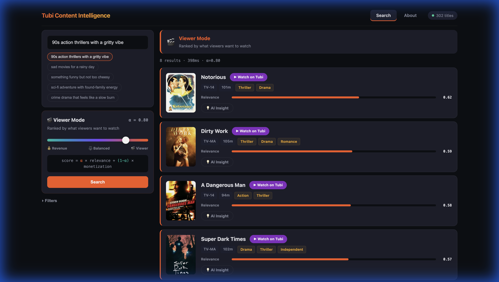

# 🎬 Tubi Content Intelligence

> A full-stack product prototype that models the **viewer satisfaction vs. ad revenue** tradeoff for AVOD streaming — built with real Tubi catalog data, semantic search, and GPT-4o-mini powered insights.

<p align="center">
  
</p>

## ✨ Key Features

| Feature | Description |
|---------|-------------|
| **Semantic Search** | Natural-language "vibe" queries over 302 real Tubi titles using Sentence-Transformer embeddings (MiniLM-L6-v2) |
| **Multi-Objective Ranking** | Tunable α-slider blends viewer relevance against monetization score — explicitly modeling the core AVOD tradeoff |
| **AI Content Insights** | Per-title content hooks and advertiser-fit strategies powered by GPT-4o-mini |
| **Brand Safety Tiers** | Automated content rating assessment with risk notes and advertiser vertical suggestions |
| **Real Movie Posters** | Live poster images resolved from Tubi's CDN with in-memory caching |
| **Resilient AI Pipeline** | Multi-provider fallback chain (LLM API → Gemini → OpenAI → heuristic) ensures insights never fail |

## 🏗️ Architecture

```
┌─────────────────────────────────────────────┐
│             React / TypeScript              │
│  About Page  │  Search + Slider + Cards     │
└──────────────┼──────────────────────────────┘
               │  REST API
┌──────────────┼──────────────────────────────┐
│           FastAPI Backend                   │
│  ┌────────┐  ┌──────────┐  ┌─────────────┐ │
│  │Semantic│  │ Ranking  │  │  AI Insight  │ │
│  │Search  │  │ Engine   │  │  Service     │ │
│  │(MiniLM)│  │ (α-blend)│  │ (GPT-4o-mini│ │
│  └────────┘  └──────────┘  └─────────────┘ │
│  ┌────────────────┐  ┌──────────────────┐   │
│  │ Brand Safety   │  │ Poster Resolver  │   │
│  │ & Ad Verticals │  │ (Tubi CDN cache) │   │
│  └────────────────┘  └──────────────────┘   │
└─────────────────────────────────────────────┘
       │                        │
  302 Tubi titles         LLM API Gateway
  (clean_titles.csv)      (llmapi.ai → GPT-4o-mini)
```

## 🚀 Quickstart

### Prerequisites
- Python 3.10+
- Node.js 18+

### 1. Clone & set up environment
```bash
git clone https://github.com/AliHasan-786/Tubi-Movie-Recommendation-System.git
cd Tubi-Movie-Recommendation-System
cp .env.example .env
# Edit .env to add your API key(s) — see "AI Insights Setup" below
```

### 2. Backend
```bash
pip install -r requirements.txt
python scripts/prepare_data.py
python scripts/build_embeddings.py   # Builds semantic embedding cache
uvicorn backend.main:app --reload --port 8000
```

### 3. Frontend
```bash
cd frontend
npm install
npm run dev
```

Open **http://localhost:5173** → the About page will load as the default landing page.

## 🤖 AI Insights Setup

The app uses a multi-provider fallback chain for AI-powered content hooks and ad strategies.
You only need **one** API key — the system will use the first available:

| Priority | Provider | Env Var | Free? |
|----------|----------|---------|-------|
| 1st | [LLM API](https://llmapi.ai) (recommended) | `LLMAPI_KEY` | ✅ Free tier |
| 2nd | Google Gemini | `GEMINI_API_KEY` | ✅ Free tier (rate-limited) |
| 3rd | OpenAI | `OPENAI_API_KEY` | ❌ Paid |
| Fallback | Heuristic rules | — | ✅ Always available |

If no API key is configured, the app still works using heuristic-generated insights.

## 🐳 Docker (Single-Command Deploy)

```bash
docker build -t tubi-content-intelligence .
docker run -p 8000:8000 \
  -e LLMAPI_KEY=your_key_here \
  tubi-content-intelligence
```

Open **http://localhost:8000** — everything (backend + frontend) is served from one container.

## 📁 Project Structure

```
├── backend/
│   ├── main.py                 # FastAPI app + API endpoints
│   ├── config.py               # Environment-based settings
│   ├── models.py               # Pydantic data models
│   └── services/
│       ├── search_service.py   # Semantic search + ranking
│       ├── insights_service.py # Multi-provider LLM insights
│       ├── data_store.py       # Data loading + catalog
│       └── logging_service.py  # Telemetry logger
├── frontend/
│   └── src/
│       ├── App.tsx             # Main React app (Search + About)
│       ├── styles.css          # Full design system
│       └── types.ts            # TypeScript interfaces
├── scripts/
│   ├── prepare_data.py         # Data cleaning pipeline
│   └── build_embeddings.py     # Embedding cache builder
├── docs/                       # Product documentation
│   ├── PRD.md
│   ├── METRICS.md
│   ├── EXPERIMENT_PLAN.md
│   ├── USER_RESEARCH.md
│   └── ROADMAP.md
├── eval/                       # Offline retrieval evaluation
│   ├── run_eval.py
│   └── queries.jsonl
├── prompts/                    # LLM prompt templates
├── Dockerfile                  # Multi-stage production build
└── .env.example                # Environment template
```

## 📊 Product Documentation

This repo includes product artifacts that demonstrate PM-level thinking:

| Document | Purpose |
|----------|---------|
| [`PRD.md`](docs/PRD.md) | Product Requirements Document |
| [`METRICS.md`](docs/METRICS.md) | Success metrics framework |
| [`EXPERIMENT_PLAN.md`](docs/EXPERIMENT_PLAN.md) | A/B testing design |
| [`USER_RESEARCH.md`](docs/USER_RESEARCH.md) | User research findings |
| [`ROADMAP.md`](docs/ROADMAP.md) | Product roadmap |
| [`EVALUATION.md`](docs/EVALUATION.md) | Retrieval quality evaluation |

## 🛠️ Technical Stack

- **Backend**: Python, FastAPI, Sentence-Transformers (MiniLM-L6-v2)
- **Frontend**: React 18, TypeScript, Vite
- **AI**: GPT-4o-mini via LLM API gateway (with Gemini/OpenAI fallback)
- **Data**: 302 real Tubi titles with genres, ratings, runtime, and content URLs
- **Deploy**: Docker multi-stage build, Render/Railway compatible

## 📝 License

MIT
